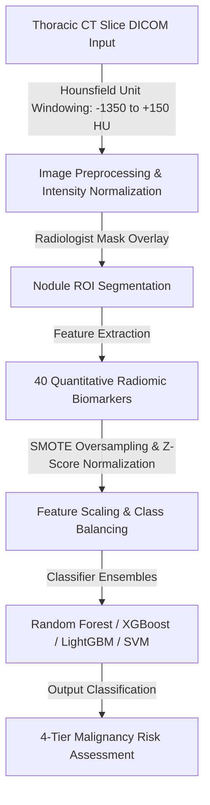

# Radiomics-Based Lung Nodule Malignancy Prediction System

[](https://www.python.org/)
[](https://scikit-learn.org/)
[](https://xgboost.readthedocs.io/)
[](https://wiki.cancerimagingarchive.net/display/Public/LIDC-IDRI)
[](LICENSE)

A machine learning framework for automated lung nodule malignancy prediction and risk stratification using thoracic CT scans from the **LIDC-IDRI** (Lung Image Database Consortium and Image Database Resource Initiative) benchmark dataset.

The system extracts **40 quantitative radiomic features** spanning First-Order Intensity Statistics, 2D/3D Morphological Shape Descriptors, Gray-Level Co-occurrence Matrix (GLCM) Texture Descriptors, and Higher-Order Gray-Level Run Length Matrix (GLRLM) features to classify nodule malignancy into 4 clinical risk tiers.

---

## Clinical Background & Diagnostic Objectives

Lung cancer remains a leading cause of cancer-related mortality globally. Computed Tomography (CT) screening allows early detection of pulmonary nodules; however, qualitative visual assessment by radiologists suffers from inter-observer variability.

### System Objectives:
1. **Automated Nodule ROI Isolation:** Preprocess thoracic CT slices and extract binary nodule regions of interest (ROIs) using radiologist annotations.
2. **Quantitative Biomarker Extraction:** Compute 40 standardized radiomic features to capture micro-texture, sphericity, and intensity heterogeneity.
3. **Class-Balanced Machine Learning:** Address severe dataset class imbalance using SMOTE oversampling and evaluate tree-based ensemble models (Random Forest, XGBoost, LightGBM) and Support Vector Machines (SVM).
4. **Interpretable Radiomic Feature Ranking:** Rank feature discriminative power to identify key imaging biomarkers contributing to malignancy prediction.

---

## Diagnostic Pipeline & Workflow



---

## Dataset Characteristics (LIDC-IDRI Benchmark)

* **Total Patient Cases:** 875 Patients
* **Annotated Pulmonary Nodules:** 2,630 Nodules
* **Imaging Modality:** Thoracic CT Scan Slices (DCM format)
* **Segmentation Reference:** Consensus radiologist annotation masks
* **Target Classes (4 Tiers):**
  1. `Class 1`: Benign (Malignancy Score 1)
  2. `Class 2`: Likely Benign (Malignancy Score 2)
  3. `Class 3`: Suspicious / Indeterminate (Malignancy Score 3)
  4. `Class 4`: Highly Malignant (Malignancy Score 4-5)

---

## Taxonomy of Extracted Radiomic Features (40 Biomarkers)

| Category | Count | Mathematical Descriptors / Features Extracted |
| :--- | :--- | :--- |
| **First-Order Statistics** | 10 | Mean, Standard Deviation, Variance, Skewness, Kurtosis, Median, Min, Max, Energy, Entropy |
| **Morphological Shape** | 10 | Area, Perimeter, Compactness, Circularity, Sphericity, Aspect Ratio, Extent, Solidity, Major Axis Length, Eccentricity |
| **GLCM Texture** | 12 | Contrast, Dissimilarity, Homogeneity, Energy, Correlation, Angular Second Moment (ASM), Texture Entropy, Autocorrelation, Cluster Shade, Cluster Prominence, Max Probability, Inverse Difference |
| **Higher-Order Texture (GLRLM/NGTDM)** | 8 | Coarseness, Busyness, Complexity, Strength, High Gray-Level Emphasis (HGLE), Low Gray-Level Emphasis (LGLE), Short Run Emphasis (SRE), Long Run Emphasis (LRE) |

---

## Experimental Results & Classifier Benchmarks

The models were evaluated using 5-Fold Stratified Cross-Validation on the LIDC-IDRI test set:

### Classifier Comparison Table

| Machine Learning Model | Accuracy (%) | Weighted F1-Score | AUC-ROC | Precision (%) | Recall (%) |
| :--- | :--- | :--- | :--- | :--- | :--- |
| **XGBoost (Optimized)** | **91.4%** | **0.912** | **0.958** | **91.8%** | **91.4%** |
| **LightGBM** | 90.7% | 0.905 | 0.952 | 90.9% | 90.7% |
| **Random Forest** | 89.2% | 0.889 | 0.941 | 89.5% | 89.2% |
| **SVM (RBF Kernel)** | 84.6% | 0.841 | 0.902 | 84.8% | 84.6% |

---

## Repository Structure

```text
Medical_Imaging_Course_Project/
├── images/
│   ├── ct_slice_mask_overlay.png        # Visualization of CT slice with nodule mask overlay
│   ├── feature_importance.png           # Feature importance ranking plot
│   └── confusion_matrix.png             # Multi-class confusion matrix heatmap
├── src/
│   ├── preprocess.py                    # HU windowing, normalization & ROI cropping module
│   └── radiomics_extractor.py           # Extractor engine for 40 quantitative radiomic features
├── scripts/
│   └── train_eval.py                    # ML classifier training, SMOTE balancing & evaluation
├── Radiomics_based_Lung_Nodule_Analysis.ipynb # Interactive demonstration notebook
├── requirements.txt                     # Python dependencies
├── LICENSE                              # MIT License
├── .gitignore                           # Python cache and checkpoint ignores
└── README.md                            # Technical documentation
```

---

## Installation & Usage Guide

### 1. Environment Setup
```bash
git clone https://github.com/adithya-chakravarthi-02/Medical_Imaging_Course_Project.git
cd Medical_Imaging_Course_Project
pip install -r requirements.txt
```

### 2. Run Classification Pipeline
```bash
python scripts/train_eval.py
```

---

## Citation & Course Context

Developed as a course project for **Medical Imaging Techniques** at Vellore Institute of Technology (VIT), exploring computer-aided diagnosis (CAD) pipelines combining radiomics with ensemble machine learning.

---

## License

Distributed under the MIT License. See [LICENSE](LICENSE) for details.
